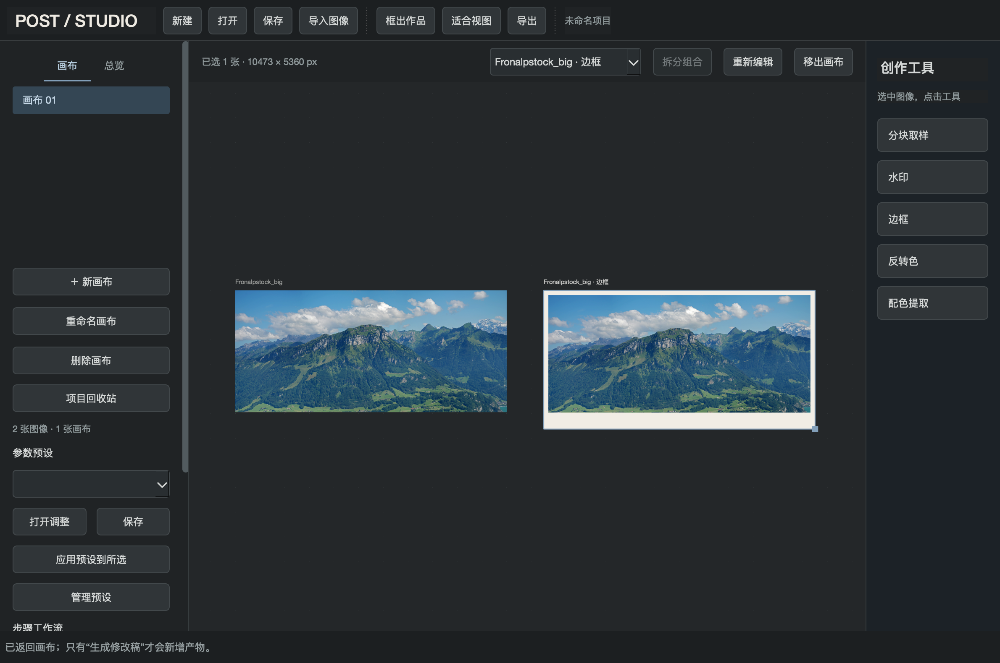

# PostStudio

离线运行的图像创作工作台。自由摆放照片，以分块取样、配色提取、边框和水印生成作品，再批量处理或框选导出。



## 当前版本

**0.4.2 本地测试版**，主要在 Apple Silicon Mac 上开发与验证。素材和图像处理留在本机；安装依赖后可离线运行。尚未提供经过 Apple 公证的安装包。

- 多画布自由布局、独立总览网格、回收站与撤销。
- 分块取样、网格和单块移动、透明／纯色／渐变背景与阴影。
- Oklab 配色提取，色条、色卡环及可拆分组合。
- 多层边框、预设和自定义外框比例。
- 文字、拍摄参数和图片水印；项目内补录胶片资料。
- 工具预设直接应用，单条节点工作流及最多 10 张批处理。
- 自包含项目文件，独立处理版本；无下游引用的末端产物可显式保存修改。
- TIFF、JPEG、PNG 输入输出；16 位中间产物与可选 2×2 降采样。

## 从源码运行

需要 Python 3.12+；已验证环境为 macOS Apple Silicon、Python 3.14。

```sh
git clone https://github.com/Eason-young-Zhang/PostStudio.git
cd PostStudio
python3 -m venv .venv
.venv/bin/python -m pip install -r requirements-lock.txt
.venv/bin/python -m blockstudio.app
```

首次安装依赖需要网络。完成后也可双击 `启动工作台.command`。锁定依赖对应开发时验证版本；跨平台兼容性尚未完整验证。

## 文档

- [用户手册](docs/USER_GUIDE.md)：按流程学习导入、工具、版本、流程与导出。
- [离线 HTML 手册](docs/USER_GUIDE.html)：下载后用浏览器打开，图片内嵌，可单文件分享。
- [开发与交接](docs/DEVELOPMENT.md) · [贡献指南](CONTRIBUTING.md)
- [变更记录](CHANGELOG.md) · [验收与已知边界](docs/ACCEPTANCE_0_4.md)
- [项目缘起、需求和四象限](docs/PROJECT_CONTEXT.md)
- [行动方案](docs/NEXT_ACTION_PLAN.md) · [实施历史](docs/IMPLEMENTATION.md) · [接续状态](docs/EXECUTION_STATUS.md)

## 测试与打包

```sh
QT_QPA_PLATFORM=offscreen .venv/bin/python -m pytest -q
zsh scripts/build-mac.sh
```

当前 66 项测试通过。构建输出为 `dist/PostStudio.app`；构建脚本需要 macOS Command Line Tools，本机签名和公证不由此脚本提供。

## 项目结构

| 目录 | 内容 |
| --- | --- |
| `blockstudio/` | 应用、图像处理、项目存储和界面；保留历史包名以兼容启动入口 |
| `tests/` | 模型、处理与 Qt 界面回归 |
| `scripts/` | 构建、手册生成和性能验证 |
| `docs/` | 使用说明、截图、需求与交接文档 |

个人 `.blockproj` 项目、原始测试照片、虚拟环境、缓存与构建产物不纳入 Git。性能和截图脚本所需的公开素材另行准备，见开发文档。

## 许可

源码使用 [MIT License](LICENSE)。手册示例照片与其衍生图像另按 [第三方素材说明](THIRD_PARTY_NOTICES.md) 中的 CC BY-SA 3.0 许可使用。
