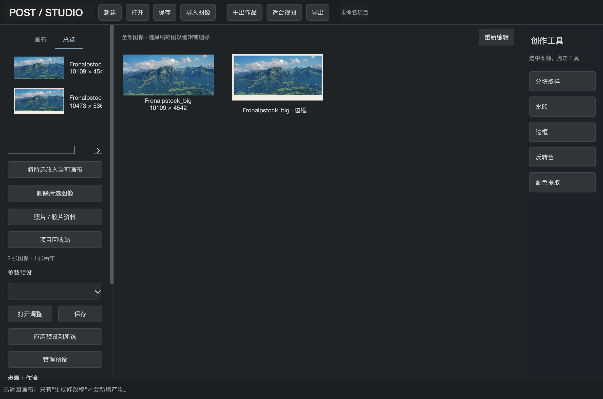
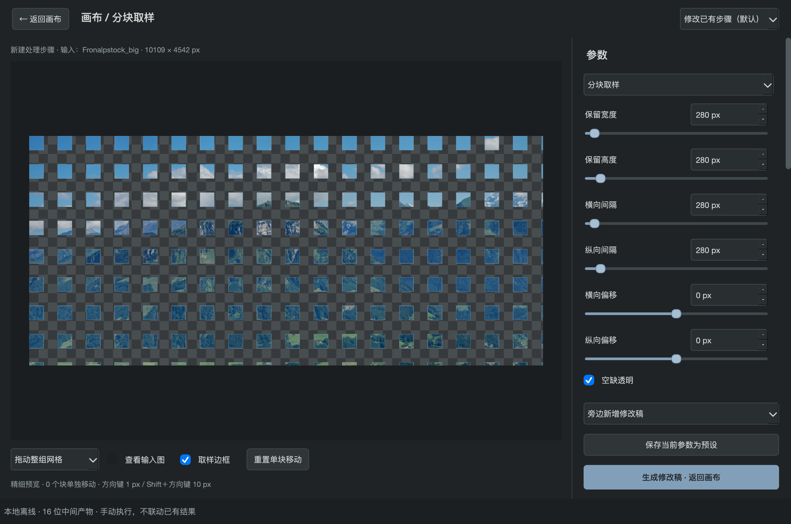
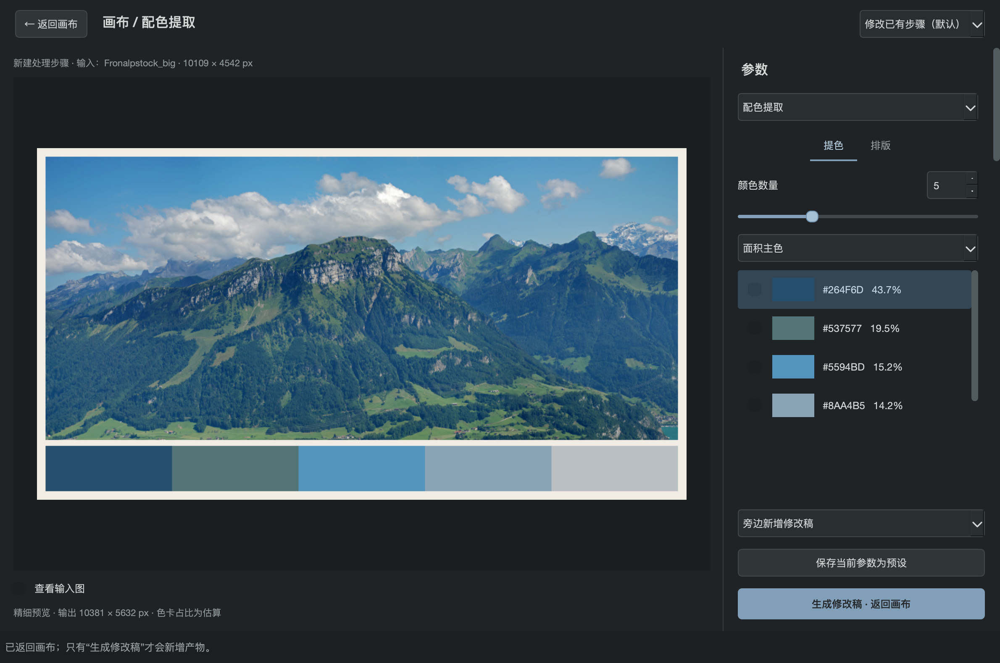
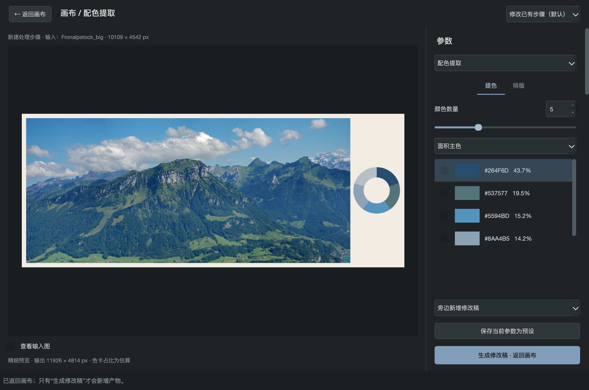
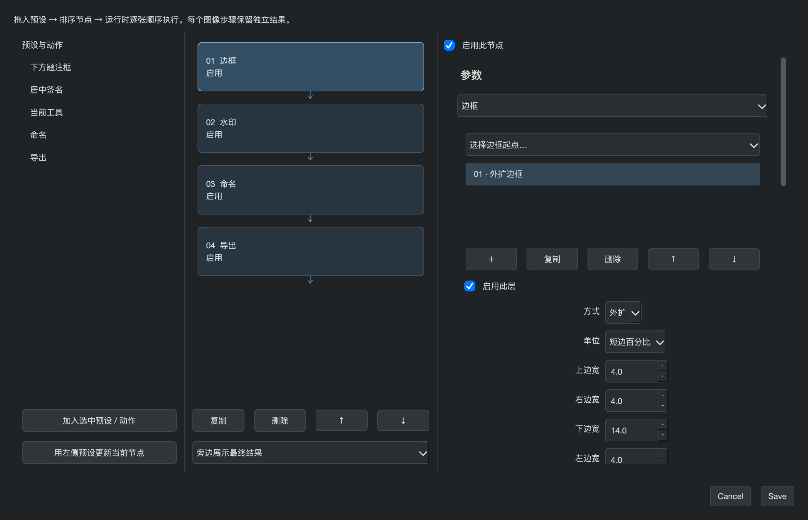
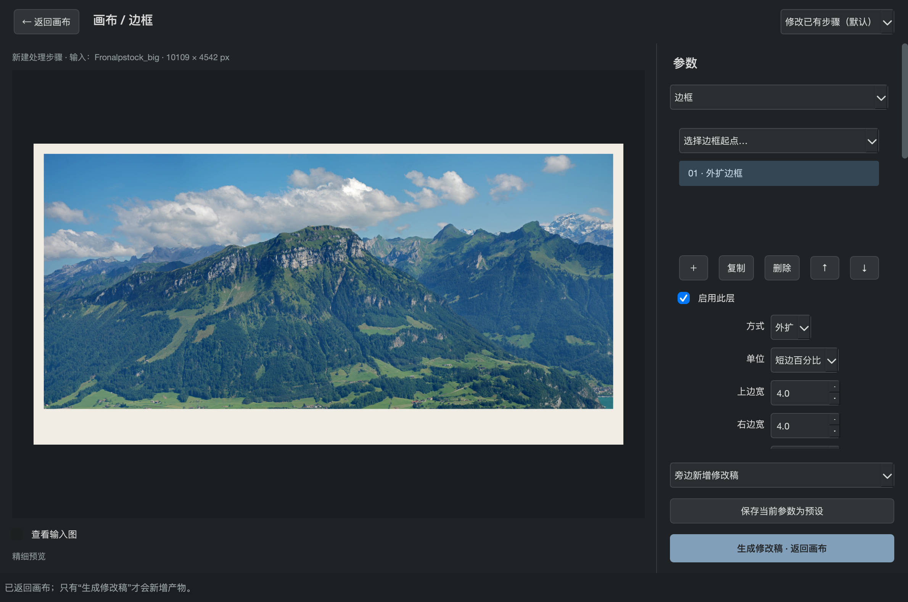
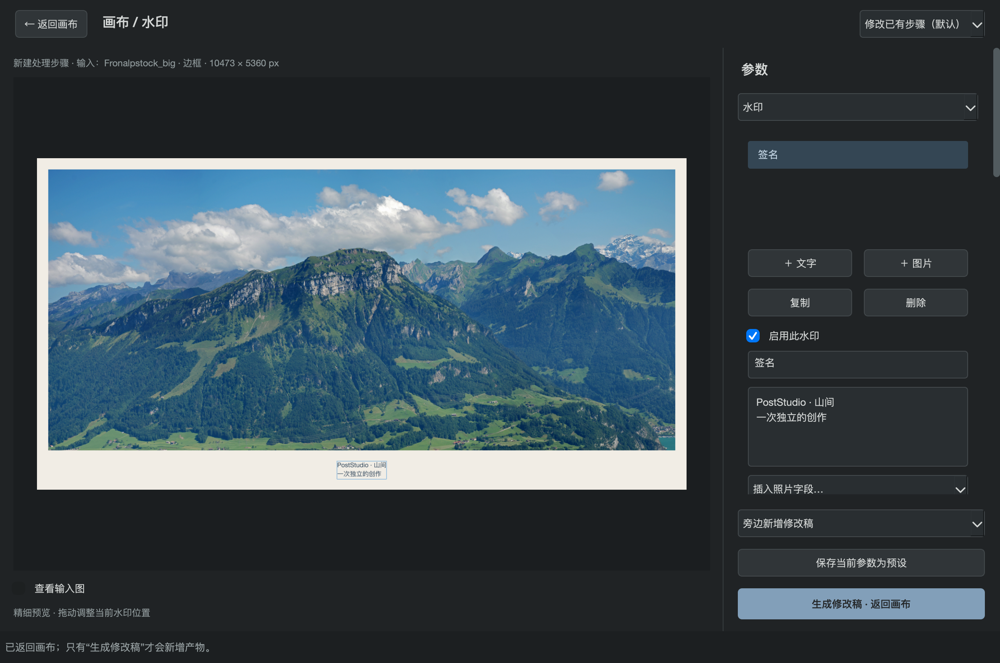

# PostStudio 用户手册

适用版本：**0.4.1 本地测试版** · 文档更新日期：2026 年 9 月 20 日

> 本手册按 0.4 的实际界面编写，并附离线 HTML 版本。验证范围和试用边界见[验收记录](ACCEPTANCE_0_4.md)。

PostStudio 是一个在 Mac 上离线使用的图像创作工作台。你可以把照片自由摆放在画布上，使用分块取样、反转色、配色提取、边框和水印工具生成独立的新稿，再比较、继续加工或导出作品。素材与处理留在本机，不需要账户或网络连接。

第一次使用，建议依次阅读第 1～6 章，完成一张取样作品；需要色卡时接着阅读第 7 章。已有经验的用户可以直接查阅工作流、导出和常见问题。

> 本手册描述已经实现的功能。界面中的“取样”是对图像像素进行艺术处理，不是在编辑 JPEG 的 DCT 系数；留空不一定会让文件变小。色卡环是配色展示，不是矢量示波器或按真实色相角度绘制的测量图。

## 目录

1. [启动软件与认识工作台](#start)
2. [新建项目与导入照片](#import)
3. [摆放照片与管理画布](#canvas)
4. [进入工具与管理独立版本](#versions)
5. [第一件作品：分块取样](#sampling)
6. [反转色与继续加工](#invert)
7. [提取配色、制作色条或色卡环](#palette)
8. [保存和复用参数预设](#presets)
9. [建立多步工作流与批量处理](#workflows)
10. [框出作品与导出图像](#export)
11. [保存项目、分享与恢复](#save)
12. [操作与快捷键速查](#shortcuts)
13. [常见问题与排查](#faq)
14. [格式、规格与当前边界](#limits)
15. [示例素材与文档说明](#credits)
16. [整理拍摄与胶片资料](#metadata)
17. [快速设计边框](#borders)
18. [添加签名、拍摄参数与图片水印](#watermarks)
19. [新版精细排版、渐变与阴影速查](#finishing)

## 1. 启动软件与认识工作台

### 1.1 打开软件

本机已安装的应用位于用户目录下的 `Applications/PostStudio.app`。在 Finder 中打开该应用即可；使用应用包不需要自行安装 Python。

如果你使用的是项目源码和已经配置好的开发环境，也可以双击项目目录内的 `启动工作台.command`。开发环境的安装与打包方法见 [开发与交接文档](DEVELOPMENT.md)，不属于日常创作的必要步骤。

当前应用为本地测试构建，尚未完成 Apple Developer 公证。朋友首次使用若遇到系统阻止打开，请先向提供者核对应用来源与兼容版本，再按 macOS 给出的安全设置提示操作。

### 1.2 两个页面分别做什么

**工作台页面**用于导入、选择、摆放和比较图像，管理画布、预设、工作流，以及保存和导出。

**工具页面**用于处理选中的图像。先在工作台选择输入，再点击画布右侧独立工具栏中的相应按钮；在二级页面调整参数，点击“生成修改稿 · 返回画布”后，新产物才会进入项目。

工作台截图中的风景照片为公开演示素材，来源见文末。截图来自 0.4 源码构建，使用当前冷蓝主题。

### 1.3 先理解五个名称

| 名称 | 含义 | 例子 |
| --- | --- | --- |
| 项目 | 一次创作的完整容器，保存成 `.blockproj` 文件 | 一卷胶片的照片、各版取样稿和排版 |
| 素材／产物 | 项目内实际保存的图像或组合 | 原图、取样稿、独立色卡 |
| 画布 | 自由摆放图像的工作空间 | “山景对照”“色卡试验”两张画布 |
| 作品框 | 在画布上圈定的一块导出区域 | 将原图和取样稿一起框入一张作品 |
| 预设／工作流 | 单个工具的参数／多个有序处理步骤 | 80 px 取样预设／取样后反转色 |

**保存项目**用于以后继续编辑；**导出图像**用于观看、发布或到绘画软件继续创作。两者不能互相替代。

## 2. 新建项目与导入照片

### 2.1 建立项目

1. 启动软件后会看到空项目和“画布 01”。已有项目打开时，点击“新建”可以开始另一个项目。
2. 如需命名，使用菜单“项目 → 重命名项目”。
3. 点击“导入图像”，在文件选择窗口中选择一张或多张 JPEG、PNG 或 TIFF。也可以把图像文件直接拖进画布。
4. 在导入选项中决定是否降采样，然后确认导入。
5. 等待图像出现在画布上，点击“保存”，为项目选择位置与文件名。

新建或打开其他项目时，如果当前项目有未保存的修改，软件会询问是否保存。

### 2.2 如何选择导入规格

| 你的目的 | 2×2 降采样 | 同时保留全尺寸原文件 | 项目中保存什么 |
| --- | --- | --- | --- |
| 保持输入原尺寸创作 | 不勾选 | 此时无需设置 | 全尺寸输入 |
| 减少工作像素量和项目开销 | 勾选 | 不勾选，默认 | 降采样后的工作图像 |
| 用小尺寸创作，但随项目保留完整原文件 | 勾选 | 勾选 | 降采样工作图像＋全尺寸原文件 |

“2×2 降采样”把相邻的 2×2 像素合成为一个像素，宽、高各减半，总像素数约降至四分之一。例如 **6000×4000 → 3000×2000**，即 24 MP → 6 MP。奇数尺寸向上取整，边缘按实际可用像素合并。它不执行额外锐化，也不保证原尺寸的所有细节都能保留。

“同时保留全尺寸原文件”默认关闭，仅在降采样时可用。**未选择降采样时，项目仍保存全尺寸输入**。无论怎样选择，磁盘上原来的照片都不会被改写。

### 2.3 已降采样，后来又想使用全尺寸原图

如果导入时勾选了保留原文件：

1. 选择当时导入的那张工作图像，而不是后来生成的取样稿。
2. 使用“项目 → 导入所选的全尺寸原文件”。
3. 在再次出现的导入选项中，不勾选降采样。
4. 全尺寸图像会作为独立输入加入项目，你可以重新处理它。

这不会把已有小尺寸产物自动变成全尺寸，也不会自动重新运行后续步骤。若当时未保留全尺寸原文件，需要从原来的磁盘位置重新导入。

## 3. 摆放照片与管理画布

### 3.1 先摆放，再确定作品范围

1. 在左侧“画布”页签选择当前画布。
2. 点击照片选择它，按住照片拖动即可移动。
3. 拖动选中照片右下角的小方块，可等比例调整它在画布上的显示大小。
4. 用滚轮缩放视图；按住空格拖动，或按住鼠标中键拖动，可平移视图。
5. 点击“适合视图”，让当前画布的内容重新进入可见区域。
6. 从空白处拖出选择框，可以框选多张照片。确认界面显示的已选数量后，再进入工具或导出。

画布上的缩放是排版操作，**不改变素材本身的像素尺寸**。想把并置排版导出成一张图，使用第 10 章的作品框。

### 3.2 总览与多画布

点击“总览”，中央区域切换为独立缩略图网格，列出项目中所有未删除的素材和产物，包括暂时没有摆在画布上的旧版本。可直接多选、进入工具、重新编辑或右键删除；切回“画布”会恢复原来的自由布局。选中总览中的条目，点击“将所选放入当前画布”，即可重新摆放。

在“画布”页签点击“＋ 新画布”建立另一组布局，使用“重命名画布”区分用途。同一素材可以放在不同画布中，图像数据共用，但位置、大小和当前显示的版本各自独立。

> 总览中选中的条目也能作为处理和导出的输入。若操作对象与你预期不同，先回到“画布”页签重新选择，并核对工具页面顶部的输入名称。

### 3.3 遮挡、移出和恢复

照片重叠时，选中要置顶的照片，使用“画布 → 所选置于顶层”。

“移出画布”移除所选照片的摆放，也可以移除所选作品框；它**不会永久删除项目中的图像**。误移出照片后，到总览重新放回即可。重新放回不会自动恢复之前的位置和显示大小。

工作台支持 ⌘Z 撤销、⌘⇧Z 重做布局与删除等可逆操作。旋转和自动吸附尚未提供。

### 3.4 删除画布、图像和找回内容

1. 删除画布：选中左侧画布，点击“删除画布”并核对提示。删除最后一张画布时会建立一张空画布。
2. 删除图像：在画布右键图像，选择“删除图像 · 移入回收站”；也可切到“总览”，选择一个或多个条目，使用删除按钮或右键菜单移入项目回收站。它们在各画布的摆放也会移除。
3. 需要找回时，打开“项目回收站”，选择记录并恢复。图像及仍存在画布上的原摆放可以恢复；画布记录可恢复整组布局。
4. 只有明确希望缩小项目时，才清理回收站。被后续产物、组合或恢复记录引用的内容会保留。清理是不可撤销动作，建议先另存副本。

这些操作不删除导入前位于磁盘上的原文件。单纯“移出画布”与“移入回收站”是两种不同操作。回收记录随项目保存。

## 4. 进入工具与管理独立版本

### 4.1 通用处理流程

1. 在画布或总览选择输入图像。一次使用工具最多选择 10 张。
2. 在画布右侧的“创作工具”栏点击“分块取样”“反转色”“配色提取”“边框”或“水印”按钮。
3. 进入二级工具页面后，检查顶部显示的输入名称与像素尺寸。
4. 调整参数并查看预览。“查看输入图”用于对照本次实际处理的来源。
5. 在底部选择新产物如何放回工作台。
6. 点击“生成修改稿 · 返回画布”，等待处理完成。
7. 回到画布后检查结果，并保存项目。

多张输入时，工具页面预览第一张，生成时将同一组参数应用到所有选中的输入。

如果只点击“← 返回画布”，不会生成产物，也不会修改现有图像。参数可能暂留在工具面板中，供立即建立工作流使用，但不能把它当作已保存的创作结果。需要长期保留时，请生成修改稿或保存预设。

### 4.2 三种结果放置方式

| 方式 | 画布上的变化 | 旧版本去向 |
| --- | --- | --- |
| 旁边新增修改稿 | 新稿放到当前图像旁边，便于比较 | 原摆放保留 |
| 原位置显示修改稿 | 当前摆放切换成新稿 | 旧图仍在总览与版本中 |
| 收入版本集合 | 当前摆放显示新稿和集合标记 | 可通过版本选择器切换 |

选择画布上的单个图像后，上方版本下拉框可切换同一来源的版本。它是同源版本列表，不是自动联动的处理时间线。

### 4.3 修改已有步骤，还是追加一个步骤

选中处理结果，点击“重新编辑”，会载入它**最后一步**的输入与参数。直接进入与最后一步相同的工具时，也默认按“修改已有步骤”处理。

如果确实希望再次加工当前成品，在工具页面选择“在当前产物上追加处理”。例如对已经有空洞的取样稿再取样，最终保留区域会是两次取样的交集。

选择不同于最后一步的工具时，是在当前选中产物上建立新的处理步骤。例如取样稿进入反转色工具，反转的就是取样稿。

### 4.4 一个版本独立的例子

1. 原图经过分块取样，生成 **a1**。
2. 选择 a1，用反转色生成 **b1**。
3. 回到 a1，点击“重新编辑”，改变取样间隔并生成 **a2**。
4. 此时 b1 保持不变，不会自动生成 b2。
5. 只有你选择 a2 并再次执行反转色，才会生成 **b2**。

要修改前面的取样步骤，应选择 a1，而不是选择 b1 后期待软件自动回到取样。每一步都由你明确执行。

### 4.5 保存末端产物的修改

1. 在画布或总览选中一个产物，点击“重新编辑”。
2. 保持“修改已有步骤”，调整该产物最后一步的参数。
3. 若该产物没有被后续处理或组合引用，点击“保存修改”，直接更新它；名称、身份和各画布上的摆放保留，不再增加一个版本。
4. 回到工作台检查结果，需要时按 ⌘Z 撤销，⌘⇧Z 重做；最后保存项目。

原图、已有下游引用的产物，以及追加处理模式不能使用此功能。回收站中的下游依赖也算引用；按钮下方会说明限制原因。此时仍可点击“生成修改稿”得到独立新版本。直接点击工具按钮进入时不提供原位保存，必须先选择“重新编辑”。撤销记录仅在本次会话内保留。

## 5. 第一件作品：分块取样

### 5.1 从一个清晰的网格开始

1. 选中原图，进入“分块取样”。
2. 将“保留宽度”和“保留高度”设为 `80 px`。
3. 将“横向间隔”和“纵向间隔”设为 `80 px`。
4. 将横向、纵向偏移先设为 `0 px`。
5. 保持“空缺透明”勾选，观察预览。
6. 按照片内容逐渐调整块大小和间隔，再微调整体位置。

这只是便于理解的起点。参数单位是**当前工作图像的像素**，不是屏幕显示像素，也不限定为 JPEG 的 8×8 块。高分辨率照片可以使用更大的数值。

### 5.2 六个参数怎么理解

| 参数 | 控制内容 | 调整结果 |
| --- | --- | --- |
| 保留宽度 | 每个窗口的横向尺寸 | 越大，横向保留的内容越多 |
| 保留高度 | 每个窗口的纵向尺寸 | 可与宽度不同，形成长条 |
| 横向间隔 | 相邻窗口之间的横向空隙 | 不是两块起点之间的距离 |
| 纵向间隔 | 相邻窗口之间的纵向空隙 | 越大，纵向留空越多 |
| 横向偏移 | 整套网格的水平位置 | 可以为负值 |
| 纵向偏移 | 整套网格的垂直位置 | 可以为负值 |

网格重复周期等于“保留尺寸＋间隔”。例如 80 px 宽的块加 80 px 横向间隔，横向每 160 px 重复一次；宽、高和间隔均为 80 px 时，忽略边缘约保留全图四分之一的面积。

保留宽、高至少为 1 px；间隔可以为 0。两方向间隔都为 0、且没有额外位移造成的空隙时，规则窗口可以连续覆盖图像。

### 5.3 滑块、精确输入和方向键

拖动滑块可连续调整。需要精确数值时，点击数字框输入，并按回车或离开该输入框确认。

滑块获得焦点后可用左右方向键；数字框可用上下方向键。若方向键没有移动取样网格，通常是焦点仍在参数控件中，先点击预览再操作。

### 5.4 整组移动与单块移动

**整组移动：**选择“拖动整组网格”，在预览上拖动。横向和纵向偏移会随之变化。预览获得焦点后，方向键每次移动 1 px，Shift＋方向键每次移动 10 px。

**单块移动：**选择“拖动单个取样块”，按住一个已保留的窗口拖动。选中窗口后，也可以用方向键微调。

单块移动改变的是窗口在源图上的取样位置：移到哪里，就保留哪里的内容；它不会把旧位置的像素剪下来贴到新位置。窗口重叠处合并保留，不会叠加颜色；移出图像边界的部分会被裁掉。

建议先确定块尺寸、间隔和整组位置，再移动单块。大幅改变网格规则后，原来的单块位移可能不再符合构图；点击“重置单块移动”可清除所有单块调整，同时保留整组偏移。

### 5.5 选择空缺的背景

| 想要的效果 | 操作 |
| --- | --- |
| 为后续绘画保留透明区域 | 勾选“空缺透明” |
| 使用白色或其他纯色 | 点击背景颜色按钮，自选颜色 |
| 从照片中取一种背景色 | 点击“图内取色”，再点击输入照片 |
| 使用本项目已有色卡的颜色 | 打开“使用项目中的色卡颜色…”并选择 |

选择具体背景色会关闭透明选项。选用色卡颜色后，保存的是当时的颜色值；以后重新提取色卡，不会自动改变这张取样稿。

棋盘格表示透明，不是作品里的图案。“取样边框”是辅助操作的轮廓，也不会出现在正式产物中。

### 5.6 生成、比较与二次尝试

选择“旁边新增修改稿”，点击“生成修改稿 · 返回画布”。将结果与原图并排摆放，观察保留的信息是否能引导你希望的观看路径。

再试另一版时，选中这张取样稿点击“重新编辑”，修改间隔后重新生成。核对输入标签仍是这一步之前的图像。如果想保留规则之外的局部变化，可继续使用单块移动。

连续操作时预览先快速响应，停手后更新精细预览。细密网格在缩小观看时可能融合；正式产物使用完整工作分辨率。不要把快速预览当作最终逐像素结果。

## 6. 反转色与继续加工

1. 选中原图或某个处理结果。
2. 选择“反转色”并进入工具。
3. 用“查看输入图”比较变化，选择结果放置方式。
4. 点击生成，回到画布保存。

反转色会对 RGB 颜色取反，透明度保持不变，没有额外调色参数。它适合艺术性的负片效果，不提供胶片橙色片基去除、曝光校正或专业负片还原。

需要在取样后反转色，就选择取样稿进入本工具；需要对原图反转后再取样，则先反转原图，再选反转稿进入分块取样。两种顺序分别生成独立产物，便于比较。

## 7. 提取配色、制作色条或色卡环

### 7.1 从照片获得一组颜色

1. 选中照片，选择“配色提取”，进入工具。
2. 在“提色”页签设置颜色数量，范围为 2～12，默认 5。
3. 选择“面积主色”或“特色配色”。
4. 等待提取完成，检查色块、色值和估算占比。
5. 如有必要，按下一节手动调整。

“面积主色”适合概括照片中大面积的用色；“特色配色”会额外关注较小面积的色彩差异。两种模式都在 Oklab 色彩空间中考虑明暗和色彩差异，但不会理解照片主体或保证找到任意微小的点睛色。

透明像素不参与提色，半透明像素按透明度加权；黑、白、灰也属于可提取颜色。占比是样本估算，不等于视觉重要性。纯色图可能只得到一种有效颜色，即使你请求更多颜色；全透明图像无法提色。

### 7.2 调整颜色、锁色和排序

**替换一个颜色：**先点击列表中的色块行，再点击“图内取色”，在输入照片上点击。此操作读取源图的 16 位颜色。也可以点击“自选颜色”打开颜色选择器。

**保留喜欢的颜色：**勾选该色块旁的复选框，将其锁定。点击行是选择，勾选才是锁色。手动选好的颜色如需在重新提取后保留，也应锁定。

**重新计算其他颜色：**点击“保留锁色 · 重新提取”。改变数量或提取模式也会重新计算未锁定颜色。颜色数量不能小于已锁定的颜色数。同一张图、相同设置再次提取，可能得到完全相同的结果；这不是随机配色按钮。

**改变顺序：**拖动色块列表中的条目。重新提取可能重新排列颜色；锁色保护颜色值，不保证原列表顺序。颜色较多时需要滚动列表。

手动替换后，占比按新的颜色重新估算。某个自选颜色可能接近 0%；按占比排版时它会很窄或不可见。希望每种颜色都清晰展示时，使用等分布局。

### 7.3 排版到照片一侧

切换到“排版”页签，依次设置：

| 设置 | 作用 |
| --- | --- |
| 形态 | “色条”或“色卡环” |
| 按颜色占比分段 | 勾选按估算占比；不勾选则等分 |
| 位置 | 照片下方、上方、左侧或右侧 |
| 色卡尺寸 | 以照片短边为基准的百分比 |
| 间距 | 照片与色卡之间的距离，按照片短边百分比计算 |
| 留边 | 外围留白，按照片短边百分比计算 |
| 背景透明／背景色 | 控制排版区域的底色，可自选或从照片取色 |
| 在色卡上显示色值与占比 | 为色卡添加文字，空间不足时自动省略 |
| 输出 | “照片＋色卡组合”或“仅色卡” |

色条的“尺寸”控制厚度；色卡环的“尺寸”控制外半径，因此环的直径是该值的两倍。比如照片短边 2000 px、尺寸 16%，色条厚度为 320 px，环的外直径为 640 px。

照片自身像素尺寸不变，组合会增加外围区域。确认页面显示的输出尺寸，避免为了很宽的留边生成不必要的大图。仅输出色卡时，位置主要决定色条朝向；照片与色卡间距不再起作用。

### 7.4 生成组合、拆开摆放

选择“照片＋色卡组合”并生成后，工作台上会出现可直接导出的完整组合。项目同时保存独立色卡组件，因此总览中新增条目的数量可能多于画布上新增的组合数量。

需要自由调整摆放时：

1. 在画布选中组合，点击“拆分组合”。
2. 照片与色卡分别出现在画布上，可以独立移动和缩放。
3. 摆好后，用作品框将它们一起导出。

旧组合仍保留在总览中，拆开后的移动不会自动更新它。拆分也不会把组合的纯色背景变成一个独立图层；需要统一底色时，在作品框导出中设置底色，或重新编辑原组合。

仅需要一条配色素材时，选择“仅色卡”再生成。已有组合继续交给其他工具时，处理对象是完整的“照片＋色卡”画面；如果只想处理照片，先选原照片或拆分后的照片。

### 7.5 把配色用于取样背景

先生成色卡或组合并返回画布，再进入分块取样，在背景参数中选择“使用项目中的色卡颜色…”。尚未生成的提色预览不会作为项目色卡出现。

## 8. 保存和复用参数预设

### 8.1 保存一个预设

1. 在工具页面把参数调到满意的状态。
2. 点击“保存当前参数为预设”，输入容易辨认的名字，例如“80方块／80间隔／透明”。
3. 返回画布并保存项目。

预设保存当前工具参数，包括取样的单块位移或色卡布局；不保存另一份输入照片，也不是多个工具的完整流程。

### 8.2 在另一张照片上使用

1. 先选择新的输入照片。
2. 在工作台左侧“参数预设”下拉框选择预设，点击“打开调整”。
3. 在打开的工具页面核对输入名称，检查效果。
4. 按需微调，再生成修改稿。

取样预设使用固定像素值。同一组参数用于不同分辨率的照片时，画面疏密比例会不同；配色布局的百分比参数则随照片尺寸变化。

### 8.3 色卡预设的两种用途

**每张图自动提色：**保存预设前，点击“保留锁色 · 重新提取”；如果不希望固定任何颜色，先解除全部锁色。这样未锁定颜色会适应新的输入。

**复用同一组品牌色或手选配色：**手动选色、锁色或排序后，预设可能保存显式颜色列表；应用到其他照片时会复用这组颜色，而不是全部重新计算。

预设随项目保存。“管理预设”可重命名、复制和删除；已有产物不受影响。暂不提供跨项目预设库。

### 8.4 不进入工具，直接批量应用

1. 在画布或总览选中最多 10 张图片。
2. 选择工作台左侧的预设。
3. 点击“应用预设到所选”。这会对当前所选图像追加执行预设，直接生成独立结果。
4. 如果要修改已有结果的原步骤，使用“重新编辑”，而不是再次应用预设。

需要检查效果时使用“打开调整”，核对输入后再提交。

## 9. 建立单条节点流程与批量处理

点击“运行”后先核对图像数、节点数、预计产物和文件数；存在缺失字段时展开详细信息。确认“开始运行”后才执行。缺失字体或导出目录需要在运行前补选。流程只在你明确启动时执行。每张输入沿同一条链顺序处理，各张使用自己的照片内容和资料。首版没有分支、合流或循环。

### 9.1 先保存需要的工具预设

例如要批量“加边框 → 签名 → 命名 → 导出”：先在一张代表照片上调好边框和水印，分别保存为预设。水印里保留 `{作者}`、`{拍摄日期}` 等模板，不要把某一张照片的解析文字写成固定文本。

### 9.2 组装节点

1. 返回工作台，点击“＋ 新工作流”。
2. 左侧是预设和命名、导出动作。拖入中央节点链，也可双击或使用“加入选中预设 / 动作”。
3. 将边框排在水印之前；需要下边框题注时，边框预设应有足够下留白。
4. 选中节点，在右侧修改参数。可拖动排序，也可用上下箭头；复制、删除和“启用此节点”控制本次步骤。
5. 设置结果展示方式。默认在旁边展示最终结果；也可展示全部步骤、在原位置显示最终结果或收入版本集合。中间产物仍保存在总览。
6. 点击 Save，输入流程名称，再保存项目。

拖入的预设是参数副本。后来修改或删除预设不会自动影响流程；要同步时，在左侧选择新预设，选中要替换的节点，点击“用左侧预设更新当前节点”。流程里的图内取色不可用：先在图像工具中取色、保存预设，再更新节点。

### 9.3 命名和导出动作

命名模板可混合文字与字段，例如 `{原文件名}-{序号}`、`旅行-{拍摄日期}-{胶卷型号}`。序号按本次输入顺序固定；非法文件名字符会清理。命名只影响本次产物及后续导出，不重命名磁盘原文件。

导出节点设置目录、JPEG／PNG／TIFF、JPEG 质量、TIFF 无损压缩、2×2 降采样、JPEG 合成底色和文件名模板。`{name}` 使用上一个命名动作的结果。重名自动加编号，不覆盖已有文件。

可以在流程中插入多次导出。导出时降采样仅影响写出的文件，后续处理仍使用工作分辨率。把项目复制给朋友后，若目录无效，运行前重新选择目录。

### 9.4 对一组照片运行

1. 检查每张照片资料；扫描照片可按第 16 章批量补录。
2. 选择最多 10 张输入。
3. 在工作台选择工作流，点击“运行”。
4. 如遇缺失字体或导出目录，按提示选择替代字体／目录。
5. 查看进度与完成报告；报告区分产物、导出文件、缺字段提醒和失败。

一张照片失败时，停止这张的剩余步骤，继续下一张。取消会在可安全停止的位置生效；已经完成的图像和文件保留。再次运行会产生新版本，不自动覆盖旧结果。

固定像素参数保持相同数值；百分比按每张图尺寸计算；自动提色按各张内容计算；手选配色复用保存的颜色；水印字段按各张资料替换。

## 10. 框出作品与导出图像

### 10.1 先决定导出哪一种内容

| 目标 | 选择方式 | 得到的结果 |
| --- | --- | --- |
| 一张原图或产物 | 只选中该图像，不选作品框 | 按该素材工作像素尺寸导出 |
| 多张独立文件 | 多选图像，不选作品框 | 分别导出到文件夹 |
| 原图与结果并置的一张作品 | 选择包含排版的作品框 | 将框内内容合成为一张图 |

作品框被选中时，导出优先处理作品框。单次请选择一个作品框；多选作品框并不等于逐个批量导出。

### 10.2 自由摆放后框出作品

1. 将原图、取样稿或色卡摆到满意的位置，调整它们的显示大小。
2. 点击顶部“框出作品”。
3. 在画布上按住并拖出矩形，圈住希望导出的范围。
4. 点击作品框边缘选择它；拖动边缘可移动整个框。
5. 需要精确比例或尺寸时，使用“画布 → 修改作品框尺寸…”。
6. 点击“导出”，选择文件名和格式。
7. 设置作品输出宽度、背景以及其他格式选项，确认导出。

作品框尺寸是画布坐标，最终导出像素宽度在导出窗口另行设置，高度按框的比例计算。例如 3:2 的作品框，输出宽度设为 3000 px，则高度为 2000 px。

框内**所有相交的当前画布图像**都会参与合成，包括没有被选中的照片；超出框的部分被裁掉，重叠按画布层次显示。图像名称、选择边框、作品框虚线和透明棋盘格不写入文件。

作品框当前通过菜单修改尺寸，不是像照片那样拖右下角缩放。

### 10.3 选择合适的文件格式

| 格式 | 输出特点 | 适合用途 |
| --- | --- | --- |
| JPEG | 8 位 sRGB；有损压缩；质量可调，默认 95；不支持透明 | 屏幕观看、分享、常规成品 |
| PNG | 16 位 sRGB；保留透明度 | 交给 Photoshop 或绘画软件二次创作 |
| TIFF | 16 位 sRGB；保留透明度；可选 Deflate 无损压缩或无压缩 | 保留较高规格、继续处理或存档 |

JPEG 即使质量为 100 也不是无损。透明区域会合成到选定背景上；即使勾选作品底透明，JPEG 文件仍不能保留透明通道。

TIFF 的 Deflate 压缩不会改变像素内容。是否选择无压缩主要取决于接收软件兼容性和你的文件管理习惯。

8 位 JPEG 输入写成 16 位文件不会恢复原来不存在的细节或消除 JPEG 压缩痕迹。

### 10.4 导出时降采样

勾选“导出时 2×2 降采样”，会在本次输出的基础上宽、高各减半。例如完整作品先按 4000×3000 合成，勾选后输出约为 2000×1500。

如果导入时已经降采样，导出时再选择一次，会再次减半。相对于最初的原文件，宽、高各变成四分之一，总像素数约为十六分之一。

直接导出单张图像时，画布上的显示大小不决定文件尺寸；当前可选保留工作尺寸或 2×2 降采样。需要指定其他输出宽度时，可用作品框合成。

### 10.5 透明底送往绘画软件

1. 分块取样时勾选“空缺透明”，生成修改稿。
2. 选中该修改稿直接导出 PNG 或 TIFF。
3. 如果通过作品框导出，同时开启作品背景透明。
4. 在 Photoshop 或绘画软件中打开文件，将绘画放在透明区域或另建图层进行创作。
5. 保存外部软件文件；如果想回到 PostStudio，导出为支持格式后重新导入。

作品框背景透明只控制框里的空白处，不会自动删除取样稿中已经填成实色的背景。误导出成 JPEG 后，也不能靠改扩展名恢复透明度。

### 10.6 批量导出与尺寸上限

多选图像后点击导出，选择目标文件夹，软件会分别生成文件；已有同名文件通过追加编号避开。单文件导出使用系统覆盖确认。

作品框输出宽度当前可设为 16～30000 px，但总合成像素量不得超过 100 MP。该限制在可选的最后降采样之前检查；遇到提示应降低输出宽度或调整作品框比例。照片与色卡组合也有合成资源上限。50 MP 是输入照片的使用规模参考，不是作品框默认尺寸。

## 11. 保存项目、分享与恢复

### 11.1 日常保存

返回工作台，点击“保存”或按 ⌘S，保存 `.blockproj`。工具页面主要用于处理，项目级操作需要回到工作台进行。

项目包含导入的工作图像、所有已生成产物、参数与输入关系、画布布局、作品框、预设、工作流，以及选择保留的全尺寸原文件。组合保存所需来源和布局，不依赖当前机器的临时合成缓存。

窗口标题中的修改标记表示项目有未保存的变化。建议在导入完成、生成满意版本和完成排版后各保存一次。

### 11.2 保留分支与分享给朋友

使用“项目 → 另存为…”或 ⌘⇧S 保存独立副本，例如“山景探索.blockproj”和“山景定稿.blockproj”。这是保留重要创作节点的简单办法。

分享时只需复制完整 `.blockproj` 文件；朋友需要在兼容版本的 PostStudio 中点击“打开”选择该文件，不需要你原来的素材目录。新能力使用 v3 项目格式，建议双方使用 PostStudio 0.4 或后续兼容版本。旧 Block Studio 不保证能打开 v3；新版可读取 v1/v2 项目，首次升级编辑建议另存一份。水印像素和图片资源随项目携带，精确重排文字还需要接收方具有相应字体。

项目保留所有产物，而不只是当前画布可见内容。移出画布不会缩小项目文件，也不是清除旧版本。若只想分享最终作品，导出 JPEG、PNG 或 TIFF 更合适。

### 11.3 异常退出后恢复

1. 重新打开软件。
2. 使用“项目 → 打开恢复副本…”。
3. 根据记录时间选择需要恢复的会话。
4. 打开后检查图像、布局和产物。
5. 主动保存成正式项目文件。

恢复副本在本机编辑过程中生成，不能保证包含崩溃前最后一瞬间的操作，也不能代替定期保存和备份。尚未生成的工具预览参数不应依赖恢复副本保留。

正常关闭会询问保存、放弃或取消，并清理当前会话临时文件。不要把“放弃修改”理解为以后仍能从恢复副本找回。

## 12. 操作与快捷键速查

以下为 Mac 操作。⌘ 表示 Command，⇧ 表示 Shift。项目快捷键用于工作台页面。

| 操作 | 方法 |
| --- | --- |
| 新建项目 | ⌘N |
| 打开项目 | ⌘O |
| 导入图像 | ⌘I |
| 保存项目 | ⌘S |
| 另存为 | ⌘⇧S |
| 导出选中内容 | ⌘E |
| 适合视图 | ⌘0 |
| 画布缩放 | 滚轮 |
| 画布平移 | 空格＋拖动，或中键拖动 |
| 多选画布图像 | 从空白处拖出选择框 |
| 调整图像显示大小 | 拖选中图像右下角 |
| 调整参数 | 拖滑块，或数字框输入后按回车 |
| 微调滑块／数字框 | 控件获得焦点后使用方向键 |
| 移动取样网格／所选块 | 预览获得焦点后使用方向键，每次 1 px |
| 加大取样微调步幅 | Shift＋方向键，每次 10 px |

画布图像目前没有方向键微移。取样工具的方向键是在移动取样窗口，与画布排版操作不同。

## 13. 常见问题与排查

### 13.1 为什么调整取样后像出现了两套网格？

先检查工具顶部的实际输入和处理方式。如果选中了“在当前产物上追加处理”，是在已有空洞上再次取样，区域相交是预期效果。

希望修改同一步时，选择对应取样稿并点击“重新编辑”，保持默认修改模式。旧 0.1 中连续且未记录意图的同工具结果，新版默认会回溯该段输入以避免错误叠加；旧产物文件仍保留。也可以直接选择原图重新处理。

如果只在很小的预览上看到条纹，停手等待精细预览，并查看导出图的实际尺寸；细密网格缩小后可能产生视觉融合，不能仅凭缩略图判断取样规则错误。

### 13.2 为什么拖动时不够清楚，停下后又变化？

连续拖动使用快速近似预览，停下后更新精细预览。正式生成和导出使用完整工作分辨率。第一次读取大图、复杂提色和生成高分辨率产物仍需要等待。

可以先等输入加载完成，再调整；对于草图试验可在导入时降采样，并按需要保留全尺寸原文件。若持续卡住而非短暂等待，先保存已有项目，记录输入尺寸、工具、参数和发生步骤，作为问题反馈。

### 13.3 调整参数后，为什么画布没有新图？

预览不是产物。需要点击“生成修改稿 · 返回画布”。单纯返回不会新建图像；工作流也需要手动点击“运行”。

### 13.4 原图或旧结果不见了怎么办？

先到总览寻找，再检查结果放置方式。原位置显示或版本集合会改变当前摆放展示的版本，但旧图仍在项目中。可以通过版本下拉框切换，或从总览重新放到画布。

### 13.5 为什么导出了别的图片，或只导出了一个框？

检查左侧当前是在总览还是画布，以及选中数量。总览选择也可以作为输入。任何选中的作品框都会优先于单图导出；请先取消无关选择，再只选目标图像或一个作品框。

### 13.6 为什么导出后没有透明底？

检查是否选择了 JPEG、取样空缺是否早已填成实色，以及作品框背景是否透明。要保留透明，应从透明产物导出 PNG 或 TIFF；作品框透明不会抠除图像内部的实色。

### 13.7 为什么色卡数量比设定少，或看不到某一种颜色？

源图的有效颜色可能不足；全透明图没有颜色。手动颜色的估算占比可能为零，按占比排版时不明显。改用等分、手动取色并锁定，可以使你要强调的颜色保留在配色方案中。

### 13.8 为什么重新提色丢了我选的颜色？

检查是否勾选锁色。仅点击色块或手动替换，并不意味着在下次重新提取时保留它。锁色之后再改变数量或模式。

### 13.9 为什么批量照片都用了同一组色卡？

预设或工作流保存了手动颜色列表。回到提色设置，解除不需要固定的锁色，点击“保留锁色 · 重新提取”，然后重新保存自动提色预设或更新工作流步骤。

### 13.10 色卡文字不见了，或尺寸不像预期？

先确认已开启文字选项，再增大色卡尺寸。空间不足时软件会省略文字。环的尺寸指外半径，不是直径；尺寸和留边等百分比均以照片短边为基准。

### 13.11 为什么项目很大，移出图像也没变小？

项目包含所有独立产物、可能保留的全尺寸原文件，以及画布之外的旧版本。内部无损压缩减少体积，但无法保证高分辨率照片和许多版本很小。移出画布只改布局。要减少内容，先移入项目回收站，再显式清理无引用的图像；仍被结果和恢复记录依赖的数据会保留。

新项目可以使用降采样输入、按需要决定是否携带全尺寸原文件，并按创作主题拆分项目。需要交付观看时导出成品，不必把完整创作项目当作图片发送。

### 13.12 导入失败，或与 Photoshop 的颜色不同？

先检查是否为支持的 JPEG、PNG 或单页整数 RGB／灰度 TIFF。RAW、多页、浮点或 CMYK TIFF 需要在其他软件转换。

无嵌入配置的图像按 sRGB 解释；有效嵌入配置在处理时转换到 sRGB。请在外部软件中确认导出时嵌入了正确配置，并注意显示器及查看软件的色彩管理。真实扫描与各绘画软件往返仍需按你的素材验证。

### 13.13 点击取消后为什么没有立刻停止？

部分任务在当前文件或处理步骤结束后响应取消。保存和打开项目期间会暂时锁定编辑，且不提供中途取消。先等待当前任务结束；已完成产物会保留。

### 13.14 能撤销、自动同步后续步骤或恢复全尺寸吗？

工作台和工具参数支持 ⌘Z／⌘⇧Z；输入文字时优先撤销文字。撤销不删除已经导出的磁盘文件，也不会自动同步后续步骤。已有图像产物保持独立，重新处理会生成新版本。未保留原文件的降采样输入不能无损恢复全尺寸，需要重新导入外部原文件。

## 14. 格式、规格与当前边界

| 项目 | 当前支持与说明 |
| --- | --- |
| 运行 | 本地 Mac 应用；当前安装构建面向 Apple Silicon；离线处理 |
| 输入 | JPEG、PNG；单页 8／16 位整数 RGB 或灰度 TIFF |
| 暂不支持输入 | RAW、多页 TIFF、CMYK TIFF、浮点 TIFF |
| 中间产物 | 16 位 RGBA sRGB TIFF，Deflate 无损压缩 |
| 典型项目规模 | 约 42 张输入照片；这是使用参考，不是导入硬上限 |
| 单张输入参考 | 50 MP 以下用于资源规划，不代表所有照片或画布规格 |
| 工具／工作流单次输入 | 最多 10 张，串行处理 |
| 版本行为 | 手动执行，生成独立新稿，旧稿与后续产物不联动 |
| 色卡 | Oklab 提取，2～12 色请求数，支持锁色、手动选色和排序 |
| 导出 | JPEG 8 位；PNG／TIFF 16 位；sRGB |
| 合成上限 | 作品框和配色组合有 100 MP 资源保护上限 |
| 项目分享 | 一个 `.blockproj` 携带素材和编辑数据；接收方需兼容应用 |

当前没有 RAW 处理、浏览器版、分支或自动联动节点系统、跨项目预设库、自动紧密拼合取样块、画布旋转与吸附。这些不要按已经可用的功能安排工作。

## 15. 示例素材与文档说明

手册截图中的风景照片为 **Hannes Röst** 的 *Fronalpstock big.jpg*，来自 [Wikimedia Commons 原始页面](https://commons.wikimedia.org/wiki/File:Fronalpstock_big.jpg)，使用 [CC BY-SA 3.0](https://creativecommons.org/licenses/by-sa/3.0/) 许可。示例中照片经过显示缩放、取样或添加色卡；照片衍生部分沿用该许可。截图没有使用用户私人照片。

本手册与 [README](../README.md) 分工不同：本手册说明如何使用；README 保存项目介绍、需求基线和交接入口。开发、测试及尚待验收事项见 [开发与交接](DEVELOPMENT.md)、[实施记录](IMPLEMENTATION.md) 和 [行动方案](NEXT_ACTION_PLAN.md)。

反馈问题时，请附上应用版本、输入格式与像素尺寸、具体操作步骤、实际结果和预期结果。涉及私人照片时，可以先用不敏感的示例图尝试复现。

## 16. 整理拍摄与胶片资料

1. 在总览选择一张或多张照片，点击“照片 / 胶片资料”。
2. 软件尽可能读取 EXIF 相机、镜头、焦距、光圈、快门、ISO 和日期。扫描照片缺少的字段不会自动猜测。
3. 仅勾选需要修改的字段，再填写胶卷、冲洗、扫描设备、地点、作者或备注。多选时的“混合值”表示各张不同，未勾选的字段保持各自内容。
4. 一卷照片可一起填写胶卷和冲洗信息；某一张特殊时，单独选择并填写覆盖值。清除单张覆盖会回到批量值或原始资料。
5. 保存项目。补录只写入项目资料，不修改磁盘原图的 EXIF。

资料沿来源传递。已生成水印保存当时的文字和像素，不会随你后来修改作者或胶卷字段而变化；重新执行水印才使用新的资料。

## 17. 快速设计边框

### 17.1 外扩留白或内遮边缘

1. 选择照片，进入“边框”工具。
2. 从细线框、四周留白、下方题注框、双层边框中选择起点，也可以自行添加层。
3. 外扩会增加输出尺寸，保留照片原像素；内遮保持输出尺寸并覆盖边缘。每层作用于上一层结果。
4. 设置上、右、下、左宽度。单位可选短边百分比或像素；留边联动可选四边独立、四边同值或横纵成对。
5. 设置纯色或渐变，选择填充或描边、描边宽度、圆角和不透明度。启用阴影时调整模糊与偏移。
6. 复制、删除、拖动或用箭头排序各层；检查预览，再生成修改稿。

内遮必须留下有效开口。阴影只在当前输出范围内显示，超出的部分裁切；想容纳阴影，先增加外扩留白。简单风格以外的纸纹、齿孔和撕边尚未提供。

### 17.2 外框比例与自定义比例

“保持当前外框比例”锁住启用时的外框形状，例如当前 4:3 就继续保持 4:3。“外框匹配图像比例”把外框改成当前输入照片的比例，例如 3:2。

还可以选择“指定外框比例”，从 1:1、3:2、2:3、4:3、3:4、16:9、9:16、5:4、4:5 中选择，或输入自定义的宽、高比例（例如 7:5）。这里的宽、高是比例数值，不是像素尺寸；实际尺寸由照片和最低留边决定，整数像素取整可能带来约 1 像素误差。

这些模式都只增加外围区域，不拉伸照片。“外框整体尺寸”在能容纳内容的最小外框基础上同比例放大；“内容水平／垂直位置”分配额外空白，得到不对称留边。内遮的输出大小固定，因此外框比例与缩放不可用。

## 18. 添加签名、拍摄参数与图片水印

### 18.1 角落签名

1. 选照片，进入“水印”工具。新建文字层。
2. 输入自己的签名，或从“插入照片字段”选作者。自由文字可与字段混排。
3. 设置字体、字号、粗体、颜色、不透明度、行距和字距；字号可使用像素或定位区域短边百分比。
4. 选右下等九宫格锚点，再拖动预览中的当前水印，或精确修改偏移。方向键微移，Shift 加大步幅。
5. 按需设置旋转、文字对齐、描边、阴影及混合模式。
6. 检查预览后生成修改稿。原图及旧版本保持不变。

“水印宽度 %”是相对于定位区域宽度的最大文字行宽／图片宽度。文字过长会换行；超出画面会显示裁切提示，应调整字号、宽度或位置。缺失字体会提示，选择替代字体后再生成；项目不嵌入字体文件。

### 18.2 拍摄参数题注

1. 先用边框工具生成下方较宽的题注框。
2. 选择边框结果，进入水印工具。
3. 输入 `{相机型号} · {镜头} · {焦距} · {光圈} · {快门} · ISO {ISO}`，也可以用字段菜单插入准确名称。
4. 将定位参考设为“下边框区域”，锚点选下中或居中，调整偏移及文字颜色。
5. 核对“当前预览”中的解析文字。缺少字段可隐藏片段、显示占位符或使该张失败并报告。
6. 保存预设，用流程对多张照片分别替换字段。

若输入没有可靠的照片／下边框区域，软件会提示；改用整张图像定位或先建立边框。请不要把缺字段时的空题注误认为渲染故障。

### 18.3 图片 Logo 和多个水印

1. 点击“＋ 图片”，导入 PNG、TIFF 或 JPEG；透明 PNG 适合 Logo。
2. 调整宽度、锚点、偏移、旋转、不透明度和混合方式。图片宽高比保持不变。
3. 再添加文字层做拍摄参数。图层列表可选择、复制、隐藏、删除和排序。
4. 保存项目；水印图片已嵌入项目，分享时不必另带外部 Logo 文件。

本版不提供重复平铺水印。多个水印层按列表顺序合成，后面的层在上方。

## 19. 新版精细排版、渐变与阴影速查

### 19.1 色卡自定尺寸和不对称留白

进入配色工具的“排版”，开启“精细布局”。选择像素或照片短边百分比，分别填上、右、下、左留边及间距。可通过同值或成对联动快速修改；需要不对称时选独立。

色卡宽、高可分别设置，0 表示自动。色条可变成短条，配合起点／居中／末端和偏移对齐照片。色卡环默认保持圆形；取消保持圆形后允许椭圆。

比例与外框整体尺寸的含义同第 17.2 节。留边输入是最低留白要求；锁定比例额外增加的空间按内容位置分配，面板显示最终外框及实际四边像素值。照片与色卡各有独立阴影开关。

### 19.2 取样背景和取样块阴影

关闭“空缺透明”可显示背景。纯色可自行选择、图内取色，或从带有可见色块和来源名称的项目色卡列表中选择。进入图内取色后可按 Esc 或点击“取消取色”；完成取色后可 ⌘Z 撤销。

背景样式可选线性或径向渐变。选择色标，编辑位置、颜色与不透明度；至少保留两个色标。线性调整角度，径向调整中心和半径。渐变覆盖整幅输出，而不是每个小块重复。

开启“取样块悬浮阴影”后，调整颜色、不透明度、模糊、横纵偏移与单位。重叠的取样窗口按合并轮廓投影，不重复加深。透明背景可保留带半透明阴影的取样块，导出 PNG 后继续绘画。

大图加渐变或阴影的精细预览比普通取样慢。拖动时使用简化预览，停手后精细化；正式生成保留完整工作尺寸。
